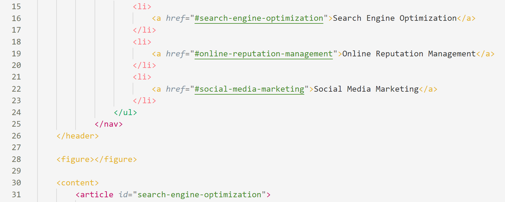
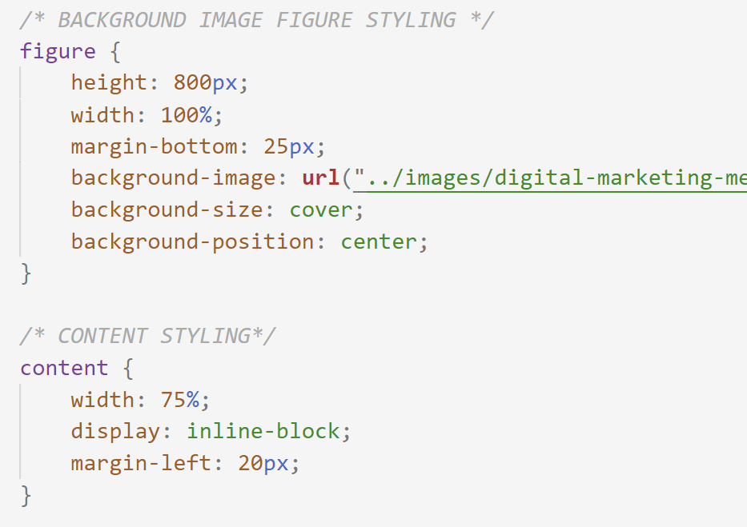

# 01 Homework: Semantic Elements

#### For this assignment, I refactored code to make a business's website more accessible for users and web developers alike. 

## Assignment Details

### User Story:

> AS A marketing agency I WANT a codebase that follows accessibility standards SO THAT our own site is optimized for search engines

### Acceptance Criteria:

> GIVEN a webpage meets accessibility standards WHEN I view the source code THEN I find semantic HTML elements WHEN I view the structure of the HTML elements THEN I find that the elements follow a logical structure independent of styling and positioning WHEN I view the image elements THEN I find accessible alt attributes WHEN I view the heading attributes THEN they fall in sequential order WHEN I view the title element THEN I find a concise, descriptive title

### 🎯Formatting the HTML file

- First, I updated the title of the webpage from "title" to "Horiseon Marketing Solutions." This concise title is displayed on the tab of the webpage and helps to make this website easier to find on search engines.

- I made sure the heading attributes were in sequential order by changing the h2 element in the footer to h4, to follow in sequence with the other headers. This will also simplify the stylesheet because each heading tag is unique.

- Next, I edited the indentation of all the elements so that everything was properly nested. I nested the child👩‍👦 elements of all headings (h1, h2, h3, h4) to improve the flow of the document.
- Finally, I added "alt" attributes to all of the images. This is an extremely important step as adding these attribute descriptions to images ensures that the website is accessible to people with disabilities. Accessible websites also rank higher in search engine website results, which would be of the upmost importance to a marketing company like Horiseon.

- I added descriptive captions to each of the .png images📸, "Benefits of Search Engine Optimization," "Bar Graph of Reputation Increasing," and "Social Media Marketing Team Meeting," respectively. For the .png images, I added the following alt descriptions: "Lead Generation Lightbulb Icon,"💡 "Brand Awareness Lightbulb Icon,"💡 and "Cost Management Coins Icon."💰

### 🎯Refactoring the Semantic Tags

In this commit, I focused on the semantic elements in the HTML document. I noticed that 
 tags were overused and paired with redundant ID and/or class names. I replaced both the div element and the corresponding class/ID names with one semantic tag wherever possible. This consolidates and cleans up both the HTML and CSS files. 

- First, I added semantic elements and consolidated CSS selectors (class/ID) in the HTML file. Here are some changes I made:

  | **Before**                                                   | **After**                                   | **Line** |
  | :----------------------------------------------------------- | ------------------------------------------- | -------- |
  | div class="header"                                         | header                                    | 11,26    |
  | div                                                        | nav                                       | 13,25    |
  | div class="hero"                                           | figure                                    | 28       |
  | div class="content"                                        | content                                   | 30,55    |
  | div id="online-reputation-management" class="online-reputation-management" | article id="online-reputation-management" | 39,46    |
  | div class="benefits"                                       | aside                                     | 57,79    |

- I renamed all of the nested div elements under <aside> to section, and removed the class name for each because they all have the same styling. 

- In order to fix🔨 the broken link in the navigation for Search Engine Optimization, I replaced the class descriptor of the article on line 31 with an id descriptor so that the link in the <nav> section now goes to the proper anchor on the page.

### 🎯Refactoring the Stylesheet

- First, I updated any class selector that now can be tagged with only a semantic tag, such as the header elements, figure, content, aside, section and article. 

- I consolidated the article💬 and section selectors and the selectors for their images and headings because they all had the same property values listed.

- I changed🔄 the order of the document so that the selectors were in the same order as they appear on the HTML document in order to create two cohesive documents.

- I added comments to group the CSS elements into different sections for the header, background image figure📷, content, aside, and footer.

  

### 🎯The final product

